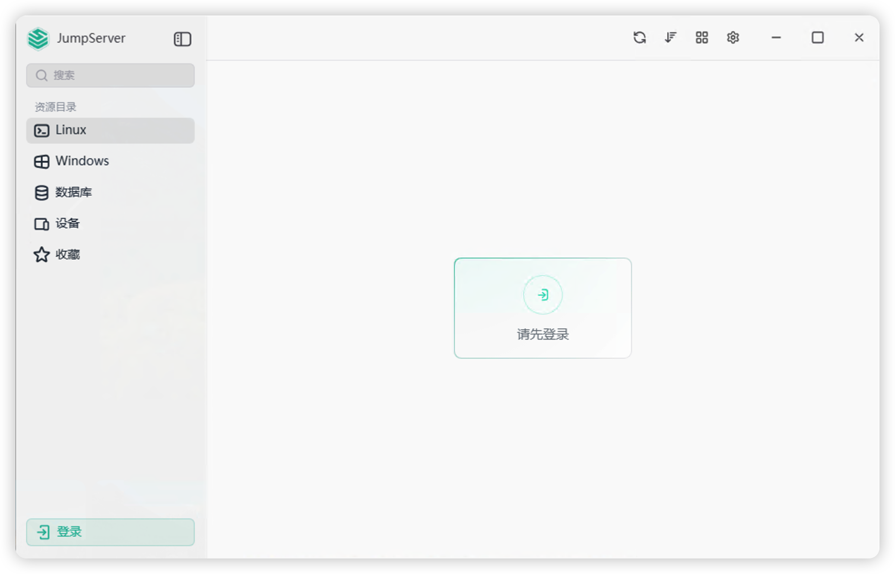

<div align="center">

# 🚀 JumpServer Client

**A modern, cross-platform desktop client for JumpServer built with Tauri**

[](https://opensource.org/licenses/MIT)
[](https://github.com/jumpserver/clients)
[](https://tauri.app/)
[](https://vuejs.org/)

[English](README.md) | [中文](README_CN.md)


</div>

---

## ✨ Features

- 🎯 **Cross-Platform Support** - Native applications for macOS, Windows, and Linux
- 🔐 **Secure Connections** - Support for SSH, RDP, VNC, and database protocols
- 🗄️ **Multi-Database Support** - Connect to MySQL, PostgreSQL, Redis, MongoDB, Oracle, SQL Server, ClickHouse, and more
- 🖥️ **Device Management** - Manage Linux and Windows servers seamlessly
- 🎨 **Modern UI** - Beautiful, responsive interface built with Vue 3 and Nuxt UI
- ⚡ **High Performance** - Lightweight and fast, powered by Tauri (Rust backend)
- 🔗 **Deep Link Support** - Launch connections directly from web browsers via custom protocol (`jms://`)
- 🌓 **Theme Support** - Light and dark mode
- 🌍 **Internationalization** - Multi-language support (English, Chinese)
- 📋 **Clipboard Integration** - Easy copy-paste functionality
- 🔔 **Notifications** - Real-time connection status notifications
- 💾 **Persistent Storage** - Save your favorite connections and settings

## 🖼️ Screenshots

<div align="center">


*MacOS*

<br/>


*Windows*


</div>

## 🛠️ Tech Stack

### Frontend
- **Vue 3** - Progressive JavaScript framework
- **Nuxt UI** - Fully styled and customizable components

### Backend
- **Tauri 2.9** - Build smaller, faster, and more secure desktop applications
- **Rust** - Systems programming language
- **Go** - Native client components for protocol handling

## 📦 Installation

### macOS

1. Download the `.dmg` file from the [Releases](https://github.com/jumpserver/clients/releases) page
2. Open the downloaded `.dmg` file
3. Drag `JumpServer.app` to your `Applications` folder
4. Double-click `JumpServer.app` to launch (this will register the custom protocol)

### Windows

1. Download the `.msi` or `.exe` installer from the [Releases](https://github.com/jumpserver/clients/releases) page
2. Double-click the installer file
3. Follow the installation wizard (may take 10-15 seconds)
4. Launch JumpServer Client from the Start menu

### Linux

#### Debian/Ubuntu (.deb)

```bash
# Download the .deb package
wget https://github.com/jumpserver/clients/releases/latest/download/jumpserver-client_*.deb

# Install using dpkg
sudo dpkg -i jumpserver-client_*.deb

# Or install using apt
sudo apt install ./jumpserver-client_*.deb
```

#### RPM-based (Red Hat, Fedora, CentOS)

```bash
# Download the .rpm package
wget https://github.com/jumpserver/clients/releases/latest/download/jumpserver-client_*.rpm

# Install using rpm
sudo rpm -i jumpserver-client_*.rpm

# Or install using dnf/yum
sudo dnf install ./jumpserver-client_*.rpm
```

## 🚀 Usage

### Launching Connections

1. **From JumpServer Web Interface**: Click on any asset connection link - the client will automatically launch
2. **From the Client**: Browse your assets, select a connection, and click connect
3. **Custom Protocol**: Use `jms://` links to launch connections programmatically

### Supported Connection Types

- **SSH/Telnet** - Terminal connections (PuTTY, XShell, SecureCRT, iTerm2)
- **RDP** - Remote Desktop Protocol for Windows servers
- **VNC** - Virtual Network Computing for remote desktop access
- **Database Connections**:
  - MySQL
  - PostgreSQL
  - Redis
  - MongoDB
  - Oracle
  - SQL Server
  - ClickHouse
  - 达梦 (DM)

### Managing Assets

- **Favorites** - Star frequently used assets for quick access
- **Search** - Quickly find assets by name or IP address
- **Categories** - Organize assets by type (Linux, Windows, Database)
- **Rename** - Customize asset display names

## 🛠️ Development

### Prerequisites

- **Node.js** >= 20
- **pnpm** >= 10.20.0
- **Rust** (latest stable)
- **System Dependencies**:
  - macOS: Xcode Command Line Tools
  - Windows: Microsoft Visual C++ Build Tools
  - Linux: `build-essential`, `libwebkit2gtk-4.0-dev`, `libssl-dev`, `libayatana-appindicator3-dev`, `librsvg2-dev`

### Getting Started

```bash
# Clone the repository
git clone https://github.com/jumpserver/clients.git
cd clients

# Install dependencies
pnpm install

# Start development server
pnpm tauri:dev
```

### Build for Production

```bash
# Build for current platform
pnpm tauri:build

# Build for specific platform (requires cross-compilation setup)
pnpm tauri:build --target x86_64-pc-windows-msi
pnpm tauri:build --target x86_64-apple-darwin
pnpm tauri:build --target x86_64-unknown-linux-gnu
```

### Project Structure

```
clients/
├── ui/                    # Frontend (Vue/Nuxt)
│   ├── components/        # Vue components
│   ├── pages/            # Application pages
│   ├── composables/      # Vue composables
│   └── layouts/          # Layout components
├── src-tauri/            # Backend (Rust/Tauri)
│   ├── src/
│   │   ├── commands/     # Tauri commands
│   │   ├── service/      # Business logic
│   │   └── setup/        # App setup
│   └── resources/        # Native binaries
├── go-client/            # Go client components
└── i18n/                 # Internationalization files
```

### Available Scripts

```bash
pnpm dev              # Start Nuxt dev server
pnpm tauri:dev        # Start Tauri dev mode
pnpm tauri:build      # Build production app
pnpm lint             # Run ESLint
pnpm prettier         # Format code with Prettier
pnpm reset            # Clean build artifacts
```

## 🤝 Contributing

Contributions are welcome! Please feel free to submit a Pull Request.

1. Fork the repository
2. Create your feature branch (`git checkout -b feature/AmazingFeature`)
3. Commit your changes (`git commit -m 'Add some AmazingFeature'`)
4. Push to the branch (`git push origin feature/AmazingFeature`)
5. Open a Pull Request

### Development Guidelines

- Follow the existing code style
- Write meaningful commit messages
- Add tests for new features
- Update documentation as needed
- Ensure all checks pass before submitting

## 📝 License

This project is licensed under the MIT License - see the [LICENSE](LICENSE) file for details.

## 🙏 Acknowledgments

- [JumpServer](https://github.com/jumpserver/jumpserver) - The open-source bastion host
- [Tauri](https://tauri.app/) - Build smaller, faster, and more secure desktop applications
- [Vue.js](https://vuejs.org/) - The Progressive JavaScript Framework
- [Nuxt](https://nuxt.com/) - The Intuitive Vue Framework

## 📚 Related Resources

- [JumpServer Documentation](https://docs.jumpserver.org/)
- [Packaging Guide](https://github.com/jumpserver/apps/blob/master/README_PACK.md)
- [Browser Deep Link Protocol](https://juejin.cn/post/6844903989155217421)
- [Linux Custom Protocol Handling](https://medium.com/swlh/custom-protocol-handling-how-to-8ac41ff651eb)

## 📮 Support

- **Issues**: [GitHub Issues](https://github.com/jumpserver/clients/issues)
- **Discussions**: [GitHub Discussions](https://github.com/jumpserver/clients/discussions)
- **JumpServer Community**: [JumpServer Community](https://github.com/jumpserver/jumpserver)

---

<div align="center">

Made with ❤️ by the JumpServer Team

[⭐ Star us on GitHub](https://github.com/jumpserver/clients) | [📖 Documentation](https://docs.jumpserver.org/) | [🐛 Report Bug](https://github.com/jumpserver/clients/issues)

</div>
