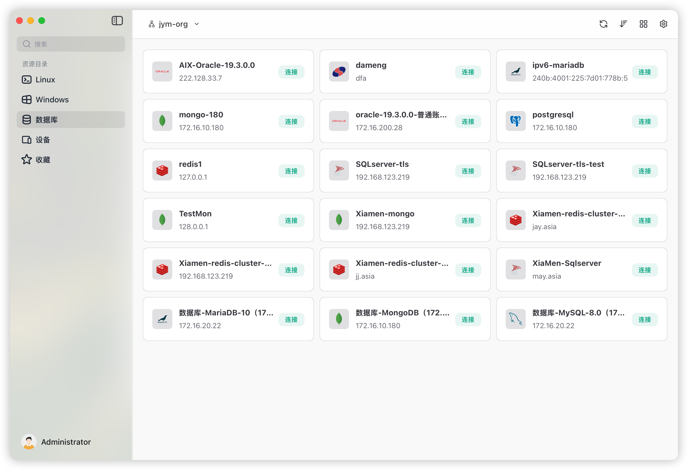

<div align="center">

# 🚀 JumpServer 客户端

**基于 Tauri 构建的现代化跨平台 JumpServer 桌面客户端**

[](https://opensource.org/licenses/MIT)
[](https://github.com/jumpserver/clients)
[](https://tauri.app/)
[](https://vuejs.org/)

[English](README.md) | [中文](README_CN.md)



</div>

---

## ✨ 特性

- 🎯 **跨平台支持** - 支持 macOS、Windows 和 Linux 原生应用
- 🔐 **安全连接** - 支持 SSH、RDP、VNC 和数据库协议
- 🗄️ **多数据库支持** - 支持 MySQL、PostgreSQL、Redis、MongoDB、Oracle、SQL Server、ClickHouse、达梦等
- 🖥️ **设备管理** - 无缝管理 Linux 和 Windows 服务器
- 🎨 **现代化界面** - 基于 Vue 3 和 Nuxt UI 构建的优雅响应式界面
- ⚡ **高性能** - 轻量级且快速，由 Tauri（Rust 后端）驱动
- 🔗 **深度链接支持** - 通过自定义协议（`jms://`）从浏览器直接启动连接
- 🌓 **主题支持** - 支持浅色和深色模式
- 🌍 **国际化** - 多语言支持（英文、中文）
- 📋 **剪贴板集成** - 便捷的复制粘贴功能
- 🔔 **通知** - 实时连接状态通知
- 💾 **持久化存储** - 保存您喜爱的连接和设置

## 🖼️ 截图

<div align="center">


*主界面展示资产管理*

</div>

## 🛠️ 技术栈

### 前端
- **Vue 3** - 渐进式 JavaScript 框架
- **Nuxt UI** - 完全样式化和可自定义的组件

### 后端
- **Tauri 2.9** - 构建更小、更快、更安全的桌面应用程序
- **Rust** - 系统编程语言
- **Go** - 用于协议处理的原生客户端组件

## 📦 安装

### macOS

1. 从 [Releases](https://github.com/jumpserver/clients/releases) 页面下载 `.dmg` 文件
2. 打开下载的 `.dmg` 文件
3. 将 `JumpServer.app` 拖拽到 `应用程序` 文件夹
4. 双击 `JumpServer.app` 启动（这将注册自定义协议）

### Windows

1. 从 [Releases](https://github.com/jumpserver/clients/releases) 页面下载 `.msi` 或 `.exe` 安装程序
2. 双击安装程序文件
3. 按照安装向导操作（可能需要 10-15 秒）
4. 从开始菜单启动 JumpServer 客户端

### Linux

#### Debian/Ubuntu (.deb)

```bash
# 下载 .deb 安装包
wget https://github.com/jumpserver/clients/releases/latest/download/jumpserver-client_*.deb

# 使用 dpkg 安装
sudo dpkg -i jumpserver-client_*.deb

# 或使用 apt 安装
sudo apt install ./jumpserver-client_*.deb
```

#### RPM 系列 (Red Hat, Fedora, CentOS)

```bash
# 下载 .rpm 安装包
wget https://github.com/jumpserver/clients/releases/latest/download/jumpserver-client_*.rpm

# 使用 rpm 安装
sudo rpm -i jumpserver-client_*.rpm

# 或使用 dnf/yum 安装
sudo dnf install ./jumpserver-client_*.rpm
```

## 🚀 使用

### 启动连接

1. **从 JumpServer Web 界面**：点击任何资产连接链接 - 客户端将自动启动
2. **从客户端**：浏览您的资产，选择连接，然后点击连接
3. **自定义协议**：使用 `jms://` 链接以编程方式启动连接

### 支持的连接类型

- **SSH/Telnet** - 终端连接（PuTTY、XShell、SecureCRT、iTerm2）
- **RDP** - Windows 服务器的远程桌面协议
- **VNC** - 用于远程桌面访问的虚拟网络计算
- **数据库连接**：
  - MySQL
  - PostgreSQL
  - Redis
  - MongoDB
  - Oracle
  - SQL Server
  - ClickHouse
  - 达梦 (DM)

### 资产管理

- **收藏夹** - 将常用资产标记为收藏以便快速访问
- **搜索** - 通过名称或 IP 地址快速查找资产
- **分类** - 按类型组织资产（Linux、Windows、数据库）
- **重命名** - 自定义资产显示名称

## 🛠️ 开发

### 前置要求

- **Node.js** >= 20
- **pnpm** >= 10.20.0
- **Rust** (最新稳定版)
- **系统依赖**：
  - macOS: Xcode Command Line Tools
  - Windows: Microsoft Visual C++ Build Tools
  - Linux: `build-essential`, `libwebkit2gtk-4.0-dev`, `libssl-dev`, `libayatana-appindicator3-dev`, `librsvg2-dev`

### 快速开始

```bash
# 克隆仓库
git clone https://github.com/jumpserver/clients.git
cd clients

# 安装依赖
pnpm install

# 启动开发服务器
pnpm tauri:dev
```

### 构建生产版本

```bash
# 为当前平台构建
pnpm tauri:build

# 为特定平台构建（需要交叉编译设置）
pnpm tauri:build --target x86_64-pc-windows-msi
pnpm tauri:build --target x86_64-apple-darwin
pnpm tauri:build --target x86_64-unknown-linux-gnu
```

### 项目结构

```
clients/
├── ui/                    # 前端 (Vue/Nuxt)
│   ├── components/        # Vue 组件
│   ├── pages/            # 应用页面
│   ├── composables/      # Vue 组合式函数
│   └── layouts/          # 布局组件
├── src-tauri/            # 后端 (Rust/Tauri)
│   ├── src/
│   │   ├── commands/     # Tauri 命令
│   │   ├── service/      # 业务逻辑
│   │   └── setup/        # 应用设置
│   └── resources/        # 原生二进制文件
├── go-client/            # Go 客户端组件
└── i18n/                 # 国际化文件
```

### 可用脚本

```bash
pnpm dev              # 启动 Nuxt 开发服务器
pnpm tauri:dev        # 启动 Tauri 开发模式
pnpm tauri:build      # 构建生产应用
pnpm lint             # 运行 ESLint
pnpm prettier         # 使用 Prettier 格式化代码
pnpm reset            # 清理构建产物
```

## 🤝 贡献

欢迎贡献！请随时提交 Pull Request。

1. Fork 本仓库
2. 创建您的特性分支 (`git checkout -b feature/AmazingFeature`)
3. 提交您的更改 (`git commit -m '添加一些 AmazingFeature'`)
4. 推送到分支 (`git push origin feature/AmazingFeature`)
5. 打开一个 Pull Request

### 开发指南

- 遵循现有的代码风格
- 编写有意义的提交信息
- 为新功能添加测试
- 根据需要更新文档
- 确保所有检查通过后再提交

## 📝 许可证

本项目采用 MIT 许可证 - 查看 [LICENSE](LICENSE) 文件了解详情。

## 🙏 致谢

- [JumpServer](https://github.com/jumpserver/jumpserver) - 开源堡垒机
- [Tauri](https://tauri.app/) - 构建更小、更快、更安全的桌面应用程序
- [Vue.js](https://vuejs.org/) - 渐进式 JavaScript 框架
- [Nuxt](https://nuxt.com/) - 直观的 Vue 框架

## 📚 相关资源

- [JumpServer 文档](https://docs.jumpserver.org/)
- [打包指南](https://github.com/jumpserver/apps/blob/master/README_PACK.md)
- [浏览器深度链接协议](https://juejin.cn/post/6844903989155217421)
- [Linux 自定义协议处理](https://medium.com/swlh/custom-protocol-handling-how-to-8ac41ff651eb)

## 📮 支持

- **问题反馈**：[GitHub Issues](https://github.com/jumpserver/clients/issues)
- **讨论**：[GitHub Discussions](https://github.com/jumpserver/clients/discussions)
- **JumpServer 社区**：[JumpServer Community](https://github.com/jumpserver/jumpserver)

---

<div align="center">

由 JumpServer 团队用 ❤️ 制作

[⭐ 在 GitHub 上给我们点星](https://github.com/jumpserver/clients) | [📖 文档](https://docs.jumpserver.org/) | [🐛 报告问题](https://github.com/jumpserver/clients/issues)

</div>
