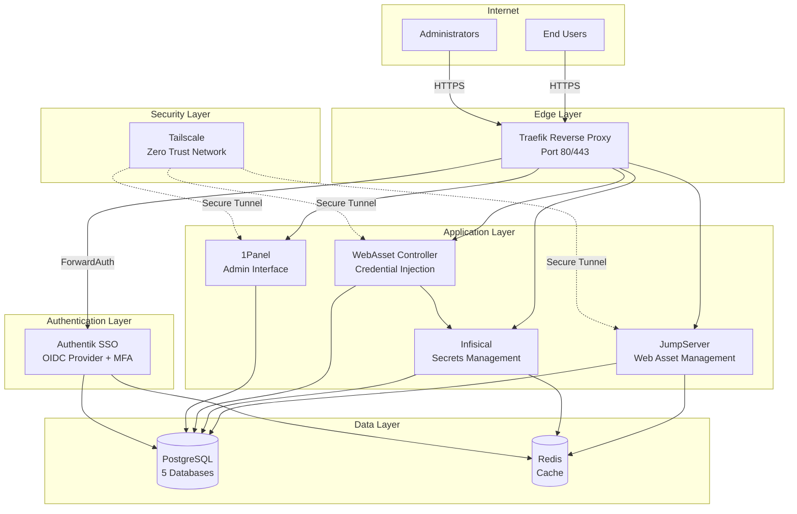
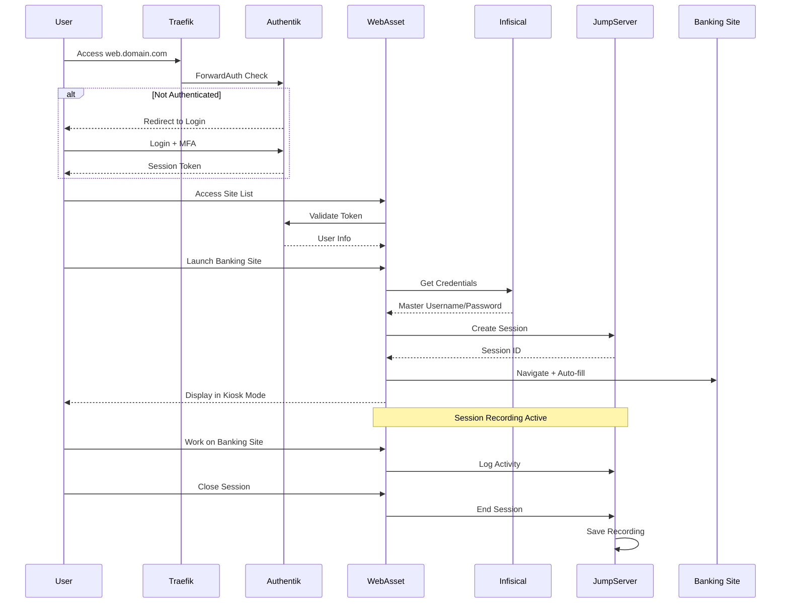
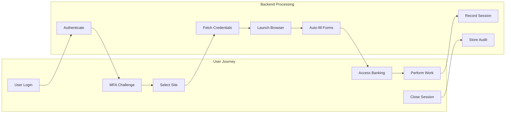
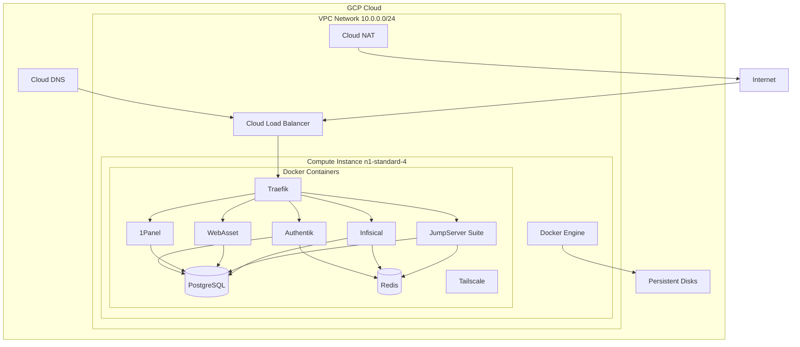
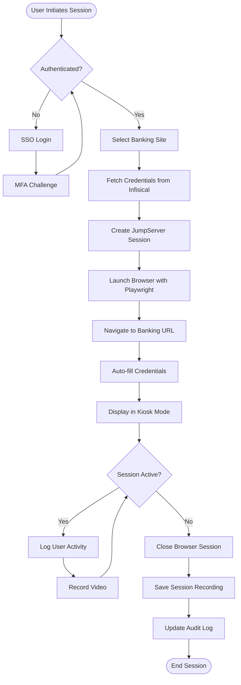
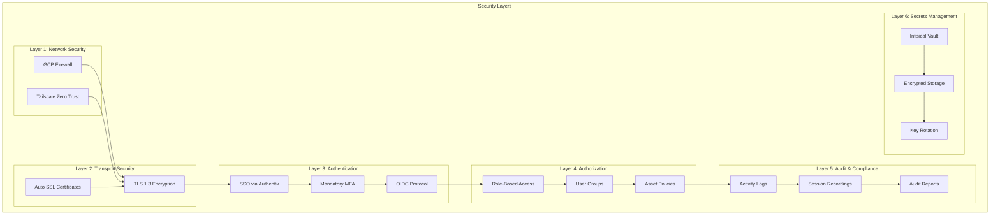
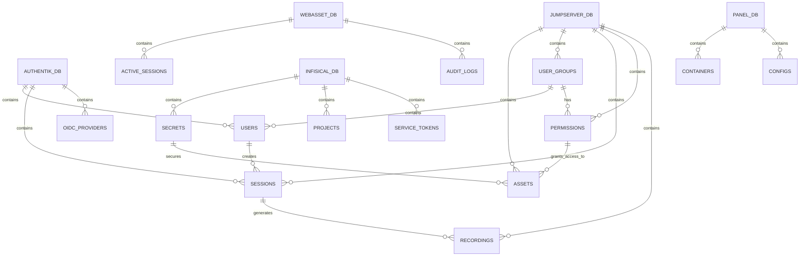

# MCP Server Architecture Diagrams

## System Architecture

## Network Flow Diagram

## Component Interaction Diagram

## Deployment Architecture

## Data Flow Diagram

## Security Architecture

## Database Schema Overview

---

## Diagram Descriptions

### System Architecture
Shows the high-level component structure with layers: Internet, Edge, Authentication, Application, Data, and Security.

### Network Flow Diagram
Illustrates the complete authentication and authorization flow from user login through MFA to accessing banking sites with credential injection.

### Component Interaction Diagram
Maps the user journey through the system and corresponding backend processes.

### Deployment Architecture
Shows the GCP infrastructure including VPC, compute instance, Docker containers, and cloud services.

### Data Flow Diagram
Details the step-by-step process of a user session from initiation to completion.

### Security Architecture
Depicts the six layers of security implemented in the system.

### Database Schema Overview
Entity relationship diagram showing the five PostgreSQL databases and their key entities.
